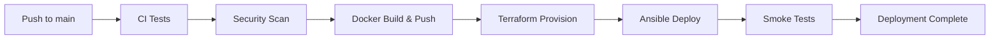

# Terraform & CI/CD Pipeline Setup Guide

## 🎯 Quick Start

This guide will help you set up the complete DevOps pipeline with Terraform infrastructure provisioning and automated deployment.

## 📋 Prerequisites Checklist

### Required Accounts
- [ ] Azure subscription
- [ ] GitHub account
- [ ] Docker Hub account

### Required Software
- [ ] Terraform >= 1.5.0
- [ ] Azure CLI
- [ ] Git
- [ ] SSH client

## 🚀 Step-by-Step Setup

### Step 1: Azure Configuration

#### 1.1 Install Azure CLI

**Windows:**
```powershell
winget install Microsoft.AzureCLI
```

**macOS:**
```bash
brew update && brew install azure-cli
```

**Linux:**
```bash
curl -sL https://aka.ms/InstallAzureCLIDeb | sudo bash
```

#### 1.2 Login to Azure

```bash
az login
az account list --output table
az account set --subscription "YOUR_SUBSCRIPTION_NAME"
```

#### 1.3 Create Service Principal

```bash
# Create Service Principal
az ad sp create-for-rbac \
  --name "taskmanager-terraform-sp" \
  --role Contributor \
  --scopes /subscriptions/YOUR_SUBSCRIPTION_ID \
  --sdk-auth

# IMPORTANT: Save the output! You'll need:
# - appId → ARM_CLIENT_ID
# - password → ARM_CLIENT_SECRET
# - tenant → ARM_TENANT_ID
# - subscriptionId → ARM_SUBSCRIPTION_ID
```

### Step 2: SSH Keys Generation

```bash
# Generate SSH key pair
ssh-keygen -t rsa -b 4096 -C "taskmanager-azure" -f ~/.ssh/taskmanager_azure -N ""

# Display public key (you'll need this for GitHub secrets)
cat ~/.ssh/taskmanager_azure.pub

# Display private key (you'll need this too)
cat ~/.ssh/taskmanager_azure
```

### Step 3: Docker Hub Setup

1. **Login to Docker Hub:** https://hub.docker.com
2. **Create Access Token:**
   - Go to Account Settings → Security → New Access Token
   - Name: `taskmanager-github-actions`
   - Permissions: Read & Write
   - **Save the token!**

### Step 4: GitHub Secrets Configuration

Go to your repository: `Settings` → `Secrets and variables` → `Actions` → `New repository secret`

Add the following secrets:

#### Azure Secrets
```
ARM_CLIENT_ID = <appId from Step 1.3>
ARM_CLIENT_SECRET = <password from Step 1.3>
ARM_SUBSCRIPTION_ID = <subscriptionId from Step 1.3>
ARM_TENANT_ID = <tenant from Step 1.3>
```

#### Azure Credentials (JSON format)
Create `AZURE_CREDENTIALS` with this format:
```json
{
  "clientId": "YOUR_ARM_CLIENT_ID",
  "clientSecret": "YOUR_ARM_CLIENT_SECRET",
  "subscriptionId": "YOUR_ARM_SUBSCRIPTION_ID",
  "tenantId": "YOUR_ARM_TENANT_ID"
}
```

#### SSH Keys
```
SSH_PUBLIC_KEY = <content of ~/.ssh/taskmanager_azure.pub>
SSH_PRIVATE_KEY = <content of ~/.ssh/taskmanager_azure>
```

#### Database
```
DB_ADMIN_PASSWORD = <your-secure-password>
DB_HOST = <will be set after terraform apply>
```

#### Application
```
APP_SECRET_KEY = <generate with: openssl rand -base64 32>
```

#### Docker Hub
```
DOCKER_HUB_USERNAME = <your-dockerhub-username>
DOCKER_HUB_TOKEN = <token from Step 3>
```

### Step 5: Terraform State Backend (Optional but Recommended)

```bash
# Create resource group for state
az group create \
  --name terraform-state-rg \
  --location eastus

# Create storage account
STORAGE_ACCOUNT_NAME="tfstate$(openssl rand -hex 4)"
az storage account create \
  --name $STORAGE_ACCOUNT_NAME \
  --resource-group terraform-state-rg \
  --location eastus \
  --sku Standard_LRS \
  --encryption-services blob

# Get storage account key
ACCOUNT_KEY=$(az storage account keys list \
  --resource-group terraform-state-rg \
  --account-name $STORAGE_ACCOUNT_NAME \
  --query '[0].value' -o tsv)

# Create blob container
az storage container create \
  --name tfstate \
  --account-name $STORAGE_ACCOUNT_NAME \
  --account-key $ACCOUNT_KEY

echo "Storage Account Name: $STORAGE_ACCOUNT_NAME"
```

Update `infrastructure/terraform/main.tf` backend configuration:
```hcl
backend "azurerm" {
  resource_group_name  = "terraform-state-rg"
  storage_account_name = "YOUR_STORAGE_ACCOUNT_NAME"
  container_name       = "tfstate"
  key                  = "taskmanager.tfstate"
}
```

### Step 6: Local Terraform Test (Optional)

Test Terraform locally before pushing to GitHub:

```bash
# Navigate to terraform directory
cd infrastructure/terraform

# Create local variables file
cp terraform.dev.tfvars.example terraform.dev.tfvars

# Edit terraform.dev.tfvars (add your secrets)

# Set Azure credentials
export ARM_CLIENT_ID="your-client-id"
export ARM_CLIENT_SECRET="your-client-secret"
export ARM_SUBSCRIPTION_ID="your-subscription-id"
export ARM_TENANT_ID="your-tenant-id"

# Initialize Terraform
terraform init

# Validate
terraform validate

# Plan
terraform plan -var-file="terraform.dev.tfvars"

# Apply (if everything looks good)
# terraform apply -var-file="terraform.dev.tfvars"
```

### Step 7: Deploy via GitHub Actions

#### Option A: Automatic Deployment (Push to main)

```bash
# Commit and push Terraform files
git add infrastructure/
git add .github/workflows/
git commit -m "Add Terraform infrastructure and deployment workflows"
git push origin main
```

The pipeline will automatically:
1. ✅ Run CI tests
2. ✅ Security scanning
3. ✅ Build Docker images
4. ✅ Provision Azure infrastructure
5. ✅ Deploy application
6. ✅ Run smoke tests

#### Option B: Manual Deployment

1. Go to **Actions** tab on GitHub
2. Select **Terraform Infrastructure** workflow
3. Click **Run workflow**
4. Choose action: `plan` or `apply`
5. Click **Run workflow**

### Step 8: Verify Deployment

Wait for the workflow to complete, then:

1. **Get the VM IP:**
   ```bash
   # From GitHub Actions output
   # Or locally:
   cd infrastructure/terraform
   terraform output vm_public_ip
   ```

2. **Test the endpoints:**
   ```bash
   VM_IP="YOUR_VM_IP"
   
   # Backend health
   curl http://$VM_IP:8000/health
   
   # Frontend
   curl http://$VM_IP:5173
   
   # API docs
   curl http://$VM_IP:8000/api/v1/docs
   ```

3. **SSH into the VM:**
   ```bash
   ssh -i ~/.ssh/taskmanager_azure azureuser@$VM_IP
   
   # Check Docker containers
   cd /opt/taskmanager
   docker-compose ps
   docker-compose logs -f
   ```

## 🔄 Workflow Overview



## 📊 Available Workflows

### 1. CI Pipeline (`.github/workflows/ci.yml`)
- Runs on every push and PR
- Backend: lint, security, tests
- Frontend: lint, security, build
- Docker: build and scan

### 2. Security Scanning (`.github/workflows/security.yml`)
- CodeQL analysis
- Semgrep SAST
- Dependency review
- Secret scanning

### 3. Terraform Infrastructure (`.github/workflows/terraform.yml`)
- Validates Terraform code
- Plans infrastructure changes
- Applies infrastructure (on main branch)
- Security scanning with tfsec & Checkov

### 4. Complete Deployment (`.github/workflows/deploy.yml`)
- End-to-end deployment pipeline
- Combines all workflows
- Deploys to Azure automatically

## 🛠️ Common Tasks

### View Terraform Outputs

```bash
cd infrastructure/terraform
terraform output                    # All outputs
terraform output vm_public_ip       # Specific output
terraform output -json > outputs.json
```

### Update Infrastructure

```bash
# Make changes to .tf files
# Push to GitHub or run locally:
terraform plan -var-file="terraform.dev.tfvars"
terraform apply -var-file="terraform.dev.tfvars"
```

### Redeploy Application

```bash
# SSH to VM
ssh -i ~/.ssh/taskmanager_azure azureuser@$VM_IP

# Pull latest images and restart
cd /opt/taskmanager
docker-compose pull
docker-compose up -d
```

### Destroy Infrastructure

**⚠️ WARNING: This will delete all resources!**

```bash
# Via GitHub Actions
# Go to Actions → Terraform Infrastructure → Run workflow → choose 'destroy'

# Or locally
cd infrastructure/terraform
terraform destroy -var-file="terraform.dev.tfvars"
```

## 🐛 Troubleshooting

### Terraform State Lock

```bash
# If state is locked
terraform force-unlock LOCK_ID
```

### GitHub Actions Failures

1. **Check secrets:** Settings → Secrets → Verify all secrets are set
2. **Check logs:** Actions → Failed workflow → Review error logs
3. **Re-run:** Actions → Failed workflow → Re-run all jobs

### SSH Connection Refused

```bash
# Check NSG rules
az network nsg rule list \
  --nsg-name nsg-app-dev \
  --resource-group rg-taskmanager-dev-eastus \
  --output table

# Add your IP if needed
az network nsg rule create \
  --resource-group rg-taskmanager-dev-eastus \
  --nsg-name nsg-app-dev \
  --name AllowMyIP \
  --priority 1000 \
  --source-address-prefixes YOUR_IP \
  --destination-port-ranges 22 \
  --access Allow \
  --protocol Tcp
```

### Application Not Starting

```bash
# SSH to VM
ssh -i ~/.ssh/taskmanager_azure azureuser@$VM_IP

# Check Docker logs
cd /opt/taskmanager
docker-compose ps
docker-compose logs backend
docker-compose logs frontend
docker-compose logs postgres

# Restart services
docker-compose down
docker-compose up -d
```

## 📚 Additional Resources

- [Terraform Documentation](infrastructure/terraform/README.md)
- [API Documentation](http://YOUR_VM_IP:8000/api/v1/docs)
- [Testing Guide](TEST_COMMANDS.md)
- [Main README](README.md)

## ✅ Success Checklist

After deployment, verify:

- [ ] GitHub Actions workflows are passing
- [ ] Azure resources are created
- [ ] VM is accessible via SSH
- [ ] Backend health endpoint returns 200
- [ ] Frontend loads in browser
- [ ] API documentation is accessible
- [ ] Database connection works

## 🎉 Next Steps

1. Configure custom domain (optional)
2. Set up SSL/TLS certificates
3. Configure monitoring alerts
4. Set up automated backups
5. Implement staging environment
6. Configure CDN for frontend

## 📞 Support

If you encounter issues:
1. Check the troubleshooting section above
2. Review GitHub Actions logs
3. Check Azure Portal for resource status
4. Review Terraform state
5. Open an issue on GitHub

---

**Happy Deploying! 🚀**
